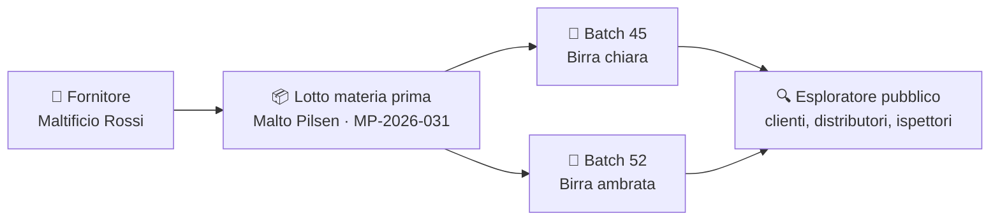
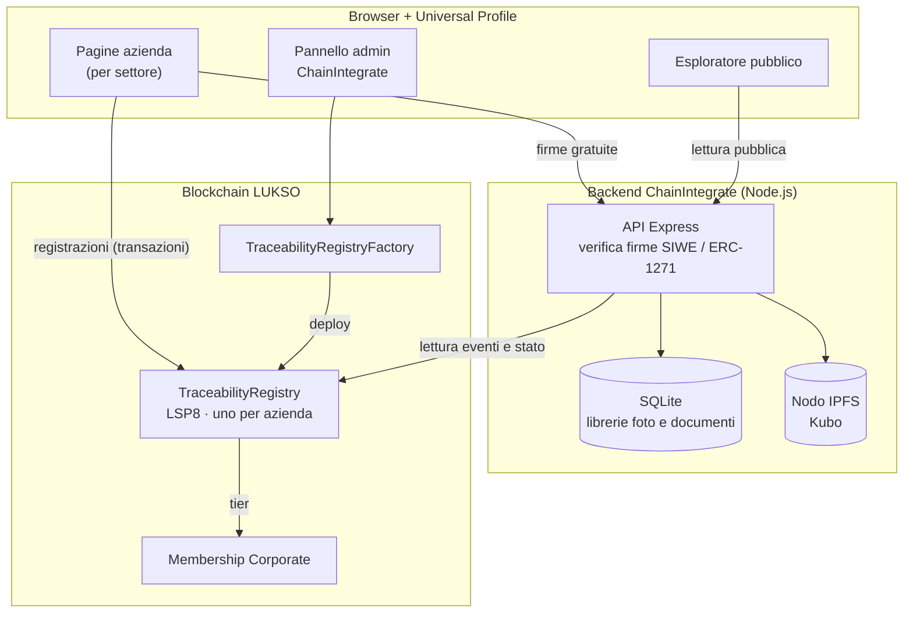

# TraceabilityRegistry

> 🇬🇧 *This README is currently in Italian. An English version will follow once the content is finalized.*

**La filiera dei tuoi prodotti, dal fornitore al cliente, scritta in modo permanente e verificabile da chiunque.**

TraceabilityRegistry è la piattaforma di tracciabilità di [ChainIntegrate](https://chainintegrate.it) basata sulla blockchain [LUKSO](https://lukso.network). Ogni azienda ha il **proprio registro**: vi registra i lotti di materia prima che riceve e i batch che produce, e il sistema li **collega tra loro**. Da un prodotto finito si risale ai fornitori; da un lotto difettoso si trovano in pochi secondi tutti i batch coinvolti. Tutto verificabile pubblicamente, senza dover credere sulla parola a nessuno, nemmeno a ChainIntegrate.

> **Stato**: operativo su **LUKSO testnet**, con tutte le funzionalità verificate dal vivo e dati reali di un'azienda pilota del settore birrario. Pronto per il passaggio a mainnet. → [Stato del progetto](#stato-del-progetto)

---

## Il problema

La tracciabilità oggi vive in registri cartacei, fogli di calcolo e gestionali chiusi. Funziona finché nessuno fa domande. Quando arrivano, i problemi sono sempre gli stessi:

- **Un richiamo è una caccia al tesoro.** Il fornitore segnala un lotto difettoso e bisogna ricostruire a mano in quali produzioni è finito.
- **La fiducia non si può dimostrare.** Cliente, distributore o ispettore devono fidarsi di un documento prodotto dall'azienda stessa, modificabile in qualunque momento.
- **I dati restano chiusi.** Ogni sistema parla la sua lingua e nessuno può verificare niente da fuori.

## La soluzione

TraceabilityRegistry scrive la storia di ogni lotto e di ogni batch su una blockchain pubblica:

- **permanente**: una registrazione confermata non si può modificare né cancellare, da nessuno;
- **verificabile**: chiunque può controllare i dati direttamente sulla blockchain, dall'esploratore pubblico o con strumenti propri;
- **tua**: ogni azienda ha un contratto dedicato, con il proprio indirizzo. Nessun altro può scriverci.

Per chi lo usa ogni giorno non ci sono wallet complicati né gergo tecnico: si accede con la propria [Universal Profile](https://universalprofile.cloud), si compila un modulo o si carica un file, si conferma.

## Il punto di forza: la tracciabilità incrociata

Ogni batch di produzione resta **collegato in modo verificabile** ai lotti di materia prima usati per farlo. Il collegamento è il numero di lotto, quello stampato sul documento del fornitore.



- **Automatico.** Quando registri un batch, il sistema cerca da solo i lotti citati tra quelli già registrati e ti mostra, prima della conferma, quali ha trovato.
- **Reale, non testuale.** Il collegamento è scritto sulla blockchain e controllato dal contratto stesso: il lotto deve esistere, essere una materia prima e non essere stato annullato.
- **Nei due sensi.** Dal batch ai lotti usati (e quindi a fornitori, date di acquisto, scadenze); dal lotto a tutti i batch che l'hanno usato.

**Esempio: un richiamo.** Il fornitore segnala il lotto `MP-2026-031`. Con una ricerca nell'esploratore vedi subito l'acquisto e tutti i batch in cui è finito. Lo stesso percorso, al contrario, lo può fare un tuo cliente per verificare da dove viene ciò che compra.

## Cosa ottiene l'azienda

| | |
|---|---|
| **Richiami in secondi** | Dal lotto sospetto a tutti i batch coinvolti con una ricerca. |
| **Fiducia dimostrabile** | Una pagina pubblica per ogni registro, verificabile da chiunque senza intermediari. |
| **Integrità dei documenti** | L'impronta digitale di certificati e fatture registrata sulla blockchain: si prova che un documento non è stato alterato. Il file resta cifrato, accessibile solo a chi è autorizzato. |
| **Nessuna doppia digitazione** | I dati si importano da file esportati dal gestionale che già usi. |
| **Nessun costo nascosto per consultare** | Consultare librerie, caricare file e verificare l'identità richiede solo firme gratuite, senza gas. |
| **Visibilità nell'ecosistema LUKSO** | Il registro è una collezione LSP8 standard, visibile su [universaleverything.io](https://universaleverything.io) con nome, descrizione e immagini dell'azienda. |

## Funzionalità

**Registrazione**
- Lotti di materia prima (fornitore, data di acquisto, quantità, lotto, scadenza) e batch di produzione (codice prodotto, date, lotti usati).
- Due modalità: modulo guidato o **caricamento di un file JSON** già compilato, che riempie il modulo per la revisione prima della conferma.
- Un acquisto con decine di materie prime: **una sola firma e una sola transazione**.
- Anteprima obbligatoria di cosa verrà scritto, prima di ogni conferma.

**Consultazione**
- **Esploratore pubblico** per ogni registro: schede con foto, attributi, lotti collegati, filtri e ricerca trasversale per numero di lotto.
- Pagina **"Come funziona"** in linguaggio non tecnico, per aziende e utenti finali.

**Documenti e immagini**
- Libreria foto e libreria documenti per registro, riutilizzabili tra le registrazioni.
- **Documenti cifrati e hash sulla blockchain**: fatture, DDT e certificati vengono cifrati prima di essere archiviati; su IPFS c'è solo una versione illeggibile e il file originale si scarica solo dal registro, con firma. Sulla blockchain si registra la sua impronta: chiunque abbia il file può verificarne l'integrità, nel proprio browser.

**Gestione**
- **Deleghe**: altri collaboratori operano con la propria identità, senza mai condividere credenziali.
- **Annullamento, mai cancellazione**: una registrazione errata viene marcata come annullata con la motivazione. Resta visibile per trasparenza e non può più essere collegata a nuovi batch.
- Interfaccia in **italiano e inglese**, messaggi d'errore comprensibili anche senza competenze blockchain.

## Piani

Le funzionalità dipendono dalla membership ChainIntegrate dell'azienda, verificata dal contratto a ogni operazione.

| | Bronze | Silver | Gold |
|---|:---:|:---:|:---:|
| Registrazione di lotti e batch, esploratore pubblico | ✓ | ✓ | ✓ |
| Libreria foto e documenti, metadata della collezione | ✓ | ✓ | ✓ |
| Registri per azienda (es. uno per stabilimento) | 1 | 2 | 5 |
| Deleghe ai collaboratori | | ✓ | ✓ |
| Hash di documento sulla blockchain | | | ✓ |

Una membership sospesa blocca nuove registrazioni e caricamenti. Tutto ciò che è già stato registrato resta consultabile e verificabile.

## Settori

Il registro si adatta al settore dell'azienda, assegnato da ChainIntegrate:

- **Alimentare, due date** (es. birrifici: produzione e imbottigliamento);
- **Alimentare, una data**;
- **Industria**.

La logica di tracciabilità è la stessa per tutti; cambiano i campi dei moduli. Nuovi settori si aggiungono senza toccare i contratti.

## Integrazione con i gestionali

Il formato di importazione è un JSON semplice e documentato, con [schemi JSON](schemas/) pubblici per [acquisti](schemas/raw-material-purchase.schema.json) e [batch](schemas/production-batch.schema.json). Il gestionale, il software di magazzino o di produzione può esportare direttamente in questo formato:

```json
{
  "name": "Birra chiara - batch 45",
  "description": "Cotta del 20 marzo",
  "attributes": [
    { "trait_type": "Codice", "value": "CHIARA-01" },
    { "trait_type": "Data Produzione", "value": "20/03/2026" },
    { "trait_type": "Lotto Malto Pilsen", "value": "MP-2026-031" }
  ]
}
```

Ogni campo `Lotto <materia prima>` crea automaticamente il collegamento al lotto registrato con lo stesso numero. I file vengono validati prima di qualunque registrazione.

## Fiducia e sicurezza, per progetto

- **Isolamento reale.** Ogni azienda ha un proprio contratto, deployato da una Factory ChainIntegrate: nessuno spazio condiviso tra aziende.
- **Chi possiede non è chi opera.** ChainIntegrate firma la collezione e interviene solo in emergenza; le registrazioni le fa l'azienda o i suoi delegati.
- **Permessi verificati dal contratto.** Membership, deleghe e funzioni Gold vengono controllate on-chain a ogni chiamata, non solo nell'interfaccia.
- **Firme trasparenti.** Le operazioni che non scrivono sulla blockchain chiedono una firma in formato standard [SIWE (EIP-4361)](https://eips.ethereum.org/EIPS/eip-4361): testo leggibile, link cliccabili, nessun costo. Il backend la verifica con ERC-1271 sulla Universal Profile e accetta solo registri deployati dalla Factory.
- **Documenti riservati cifrati.** Sulla blockchain va solo l'impronta; su IPFS solo il file cifrato (AES-256-GCM, una chiave per documento custodita da una chiave madre). Il download dell'originale passa dal backend, con firma e controllo dell'impronta. Foto e metadata dei prodotti restano pubblici per scelta, e la guida lo dice chiaramente.
- **Codice sorgente pubblico.** I contratti sono verificati su Blockscout e il codice è consultabile in questo repository.

## Architettura



**Stack**
- **Contratti**: Solidity, standard LUKSO [LSP8](https://docs.lukso.tech/standards/tokens/LSP8-Identifiable-Digital-Asset) (token identificabili) e LSP4 (metadata), Hardhat.
- **Backend**: Node.js ≥ 18, Express, better-sqlite3, ethers v5, IPFS self-hosted (Kubo).
- **Frontend**: HTML e JavaScript vanilla, senza build, ethers v5, bilingue IT/EN.
- **Identità**: Universal Profile LUKSO, firme SIWE verificate via ERC-1271.

## Stato del progetto

| | |
|---|---|
| Factory su testnet | [`0x5979…fee9`](https://explorer.execution.testnet.lukso.network/address/0x5979cFcfdCC860C3273B83e89D9FCf4D8a2bfee9), sorgente verificato su Blockscout |
| Funzionalità verificate dal vivo | registrazione lotti e batch, collegamenti, import JSON, librerie, deleghe (Silver), hash documento (Gold), sospensione (tier 0), multi-settore |
| Dati di prova | dati reali di un birrificio pilota, su registri di test |
| Mainnet | script di deploy pronto; manca la decisione su come far convivere testnet e mainnet |

Il percorso completo, con le decisioni prese e i problemi risolti, è nel [diario di sviluppo](docs/STORICO.md).

## Per sviluppatori

```
contracts/     TraceabilityRegistryFactory.sol, TraceabilityRegistry.sol
scripts/       deploy.js, test-error-messages.js
backend/       API Express (firme, IPFS, librerie, lettura on-chain)
frontend/      pagine per settore, explorer.html, admin.html, how-it-works.html
schemas/       JSON Schema dei file di importazione
docs/          STORICO.md, il diario di sviluppo
```

**Contratti**
```bash
npm install
npm run compile
npm run deploy:testnet      # oppure deploy:mainnet
```

**Backend**
```bash
cd backend
cp .env.example .env        # LUKSO_RPC_URL, FACTORY_ADDRESS, ALLOWED_MINT_UI_ORIGIN, IPFS_API_URL, DOCUMENT_MASTER_KEY, ...
npm ci
npm start                   # in produzione con pm2
```

**Test**
```bash
node scripts/test-error-messages.js      # traduzione di ogni revert dei contratti + parsing degli errori
node scripts/test-document-encryption.js # cifratura dei documenti e percorso upload → IPFS → download
```

> 🔑 **Chiave madre dei documenti.** Il backend cifra i documenti con `DOCUMENT_MASTER_KEY`: se va persa, i documenti cifrati non sono più recuperabili. Generazione, custodia, backup e recupero: [docs/CHIAVE-DOCUMENTI.md](docs/CHIAVE-DOCUMENTI.md).

> ⚠️ **Firme: frontend e backend vanno aggiornati insieme.** Il testo dei messaggi firmati è costruito in modo identico in `frontend/traceability-siwe.js` e `backend/siweMessage.js`. Ogni modifica richiede il riavvio del backend (`pm2 restart … --update-env`), altrimenti tutte le firme vengono rifiutate.

## Licenza

© ChainIntegrate. Tutti i diritti riservati: il codice è pubblico per trasparenza, non per il riuso. Vedi [LICENSE](LICENSE).
